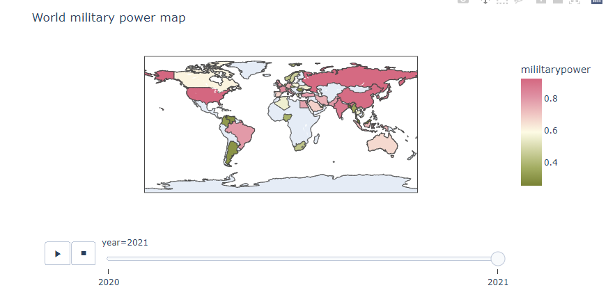

## **1. 캐글 데이터 분석 프로젝트 **

팀 : 거리두기 1단계

팀장 : 이세령,  팀원 : 노청명, 주현정, 오건녕


## **2. 프로젝트 정보**

### 1. 프로젝트 주제

​    ‘무엇이 행복에 가장 큰 영향을 미치는가’에 대한 분석

### 2. 주제 선정배경 또는 이유

​	우리의 프로젝트는 삶의 만족도에 대한 평가는 단순히 돈과 관련이 있을까라는 의문에서 시작됐다. 우리의 의문을 해결해줄 행복리포트가 있다는 사실을 발견하고 캐글에 있는 행복리포트 데이터를 활용해 행복에 영향을 미치는 요인들에 대해 분석했다. 행복리포트의 발간 배경은 빈곤이 끝나고 기본적인 경제적 필요가 더 사회 변화의 주요 동인이 아닐 때, 인류를 행복으로 인도할 것은 무엇인지에 대한 의문과 개선을 위함이다.

### 3. 프로젝트 개요

- Theme1 ; 행복리포트 속 데이터 분석

​       -GDP, Social support, Health, Freedom, Trust, Generosity

- Theme2 ; 외부데이터와 행복지수 분석 ; Covid-19, PowerIndex, Literacy

### 4. 프로젝트 환경 및 사용된 툴

|        데이터 수집        |    전처리     |                 시각화                 |           데이터 분석           |      배포      |
| :-----------------------: | :-----------: | :------------------------------------: | :-----------------------------: | :------------: |
| Beautifulsoup, kakaotrans | Pandas, numpy | Matplotlib, Seaborn, Plotly, highchart | Sklearn, Xgboost, lgbm , konlpy | pythonanywhere |

|             개발 도구              |          협업 도구           |
| :--------------------------------: | :--------------------------: |
| jupyter notebook & Colab & pycharm | Zoom & Google Drive & Github |


### 5. 가이드

  파이참 환경이 구비되어 있다면, 위 GitHub코드를 수동으로 다운받거나 cmd창에서 git clone하여 local에서 바로 사용할 수 있습니다 .또한 pythonanywhere을 통하여 웹상에 배포가 되어 있으니 하단의 링크로 직접 확인하실 수 있습니다. 


 [http://cjdauddl93.pythonanywhere.com/](http://cjdauddl93.pythonanywhere.com/)


## 3. 절차

### 1. 주제 선정

### 2. 데이터 수집 및 전처리

#### 1. 데이터 수집

|        리스트        |                             링크                             |
| :------------------: | :----------------------------------------------------------: |
| WorldHappinessReport |                https://worldhappiness.report/                |
|         WHO          |                https://covid19.who.int/info/                 |
|        Kaggle        | https://www.kaggle.com/mathurinache/world-happiness-report-20152021 |
|         GFP          |               https://www.globalfirepower.com                |
|       literacy       | https://worldpopulationreview.com/country-rankings/literacy-rate-by-country |

#### 2. 데이터 전처리

**1. 7월 9일 : Happiness Report 데이터 전처리**

1. 칼럼명 맞추기, 필요없는 칼럼 지우기 > 최종적으로 한 파일로 만들기

   ```bash
   df = pd.concat([df1,df2,df3,df4,df5,df6,df7])
   ```

   * 칼럼명 수기로 맞추고 필요없는 칼럼 지운 후 최종적으로 한 파일로 합침

2. 2017년 2018년 2019년 county region 추가

   ```python
   df1_1 = df1[['country','region']] # df1_1 = 2015년도의 데이터
   result2017 = pd.concat([df1_2,df2_2],axis=1) 
   result2018 = pd.concat([df1_2,df3_2],axis=1)
   result2019 = pd.concat([df1_2,df4_2],axis=1)
   ```

   - 2017,2018,2018년도의 county region이 존재하지 않아  가장 많은 country를 가지고 있는 2015년도의 데이터를 기준으로 추가.
     - `pandas` 로 데이터를 dataframe화 하여 `concat`을 활용하여 각 년도의 country가 2015년도의 region을 갖게함.

- 2017,2018,2018년도 결측치 조회.

   ```python
   print(df1[df1['region'].isnull() == True])
   print(df2[df2['region'].isnull() == True])
   print(df3[df3['region'].isnull() == True])
   print(df4['region'].unique())
   ```

   - `isnull`과 `unique`를 활용하여 2015년도에는 있으나 2017,18,19 년에 없는 국가들을 조회.

   - 총 10개의 결측치 데이터를 발견후 수기로 수정.

     Somalia  = Sub-Saharan Africa
     Namibia = Sub-Saharan Africa
     Gambia = Sub-Saharan Africa
     South Sudan = Sub-Saharan Africa
     North Macedonia = Central and Eastern Europe
     Northern Cyprus = Middle East and Northern Africa
     Trinidad & Tobago = Latin America and Caribbean
     Belize = Latin America and Caribbean
     Hong Kong S.A.R., China = Eastern Asia
     Taiwan Province of China = Eastern Asia

     

- 시각화를 위해 region을 5대륙으로 replace.

   ```bash 
   ['Western Europe' 'North America' 'Australia and New Zealand'
    'Middle East and Northern Africa' 'Latin America and Caribbean'
    'Southeastern Asia' 'Central and Eastern Europe' 'Eastern Asia'
    'Sub-Saharan Africa' 'Southern Asia']
   ```

   ```python
   df2 = df.replace(['Western Europe','Central and Eastern Europe','Commonwealth of Independent States'],'Europe')
   df2 = df2.replace(['Eastern Asia','Southeastern Asia','Southern Asia','Southeast Asia','East Asia','South Asia'],'Asia')
   df2 = df2.replace(['Australia and New Zealand'],'Oceania')
   df2 = df2.replace([ 'Sub-Saharan Africa', 'Middle East and North Africa', 'Middle East and Northern Africa'],'Africa')
   df2 = df2.replace(['North America and ANZ'],'North America')
   df2 = df2.replace(['Latin America and Caribbean'],'South America')
   df2.to_csv('./data_sorted.csv')
   ```

   - `unique`로 조회된 region을 `replace`하여 추출.

3. 2020년, 2021년 happiness rank 만들기

   * 엑셀 함수 활용

4. 2019년, 2020년, 2021년 Logged GDP 비교하기

   ```python
   # gdp 데이터 병합
   df19 = df1[['country', 'gdp']] #2019년도 데이터 중 country와 gdp추출
   df20 = df2[['country','gdp']] #2020년도 데이터 중 country와 gdp 추출
   df21 = df3[['country','gdp']] #2021년도 데이터 중 country와 gdp 추출
   ```

   * 엑셀 vlookup함수 이용해 country name이 달라 생기는 NaN값을 찾고 수정

**2. 7월 15일 : Happiness Report 데이터 전처리**

1. Happiness Report 6개 변수 표준화

   - 표준화로 만든 변수 : 'social_support_std','health_std','freedom_std','trust_std','generosity_std','dystopia_std','gdp_std'

   ```python
   # 표준화 함수
   def standard(data) :
       result = (data - np.mean(data, axis=0)) / np.std(data, axis=0)
       return result
   
   # 특정 칼럼 표준화하는 함수
   def column_standard(col) :
       col_new = []
       for y in range(2015, 2022) : 
           data_s = data.loc[data['year'] == y,:]
           x = standard(data_s[col]).to_list()
           col_new = col_new + x
       return col_new
   ```

   

2. 2020~2021년 : trust_std 음수로 바꾸기 & score_std 지우기

3. 2018~2019년 : dystopia 있는지 확인 후 완전 제거

   ```bash
   df1 = df.loc[:,['year','dystopia_std']]
   ```

   * 위 코드로 확인 후 완전 제거

4. 면적 칼럼 추가

   ```bash
   df15_area = pd.merge(df15_country, area,how='inner',on='country') # 15년도 나라 이름에 맞춰 면적 데이터 생성
   df_area_up = pd.merge(df,df15_area,how='outer',on='country') # 면적 데이터와 행복리포트 데이터 합치기
   df_area_up[df_area_up['total_area'].isnull()] # 결측값 확인
   ```

   * 면적 데이터를 불러온 후 15년도 나라 이름에 맞춰 합침
   * 결측값은 확인 후 
     * 나라 이름이 다른 경우 -> 나라 이름 맞춘 후 면적 데이터 대체
     * 데이터가 없는 경우 -> 구글 검색 후 면적 데이터 대체

5. 인구수 칼럼 추가

   * [장래인구](https://kosis.kr/statHtml/statHtml.do?orgId=101&tblId=DT_2KAA201&conn_path=I2) : KOSIS 데이터(2015~2021년) 활용
   * 장래인구 데이터, Happiness Report 데이터 'country' 기준으로 병합

   ```python
   from kakaotrans import Translator
   translator = Translator(); afterTrans = []
   
   for d in data['국가별'] :
       trans = translator.translate(d, src='kr', tgt='en').lower()
       afterTrans.append(trans)
   
   ndfs = pd.DataFrame()
   for y in range(2015,2022) :
       ldf = df.loc[df['year'] == y]
       rdf = pd.DataFrame(data.iloc[:,[-1,y-2014]])
       ndfs = pd.merge(ldf,rdf, how='left', left_on='country', right_on='country')
       ndf = pd.concat([ndf,ndfs])
   ```

   * 번역이 잘못된 나라이름 직접 확인하여 수정 및 재병합

**3. 7월 16일 : Happiness Report 나라 이름 맞추기 & 결측치 대체**

1. 쓸 칼럼들만 남기기

   ```python
   df_std = df.drop(['dystopia','dystopia_std','gdp', 'social_support','Logged GDP per capita', 'health', 'freedom', 'trust', 'generosity','score_std'], axis=1)
   ```
   
2. 아랍에미레이트 : 2018년 trust 결측치를 비교 후 2017년 trust로 대체 

   ```python
   df_std[df_std.trust_std.isnull()] # 결측행 1개 발견
   # 아랍에미레이트 trust_std 7개년도 비교
   for i in range(2015,2022):
       print(df[(df.year==i)&(df.country=='United Arab Emirates')['trust_std'])
   # 2017년 trust_std
   df_std[(df_std.year==2017)&(df_std.country=='United Arab Emirates')]
   ```

3. 모든 연도에 있는 나라들과 2개년도 나라들 비교

   ```python
   # 모든 연도에 있는 나라들
   df_grp_country = df.groupby('year')['country'] # 나라별로 묶기
   df_grp_country.size()
   df_yc = df[['year','country']]
   df_yc.reset_index(drop=True,inplace=True)
   col_name = ['country']
   # df -> dic
   df_group = df.groupby(col_name)
   df_dic = df_group.groups
   print(type(df_dic))
   df_dic
   # 딕셔너리에서 중복되지 않는 행 보기
   idxs = [x[0] for x in df_dic.values() if len(x) == 1]
   df.loc[idxs,:]
   ```

   ```python
   # 2개 년도씩 비교
   for i in range(2015,2022):
       df = df_std[(df_std.year==i)|(df_std.year==i+1)] 
       df.reset_index(drop=True,inplace=True)
       df_grp = df.groupby(col)
       df_di = df_grp.groups
       idx = [x[0] for x in df_di.values() if len(x) == 1]
       result = df.loc[idx,:]
       display(result)
   ```

   * north cyprus -> nothern cyprus 변경 후 지역을 유럽으로 바꿈
   * trinidad & tobago -> trinidad and tobago 변경
   * 홍콩, 대만, 소말리아 리전, 소말리아 : 2015, 20, 21만 없음

   * 소말리아랜드 : 17,18,19,20,21 없음

4. gdp 칼럼(gdp, logged gdp)을 모두 없애고 gdp_std만 사용

5. 2020년, 2021년도 호주/뉴질랜드를 오세아니아 재분류

**4. 7월 19일 : Happiness Report 지역명 수정**

1. 지역명 수정  
   * 'Latin America and Caribbean' -> 남아메리카, 북아메리카
   
   * Central and Eastern Europe' -> 유럽, 아시아
   
   * Middle East and Northern Africa -> 아시아, 아프리카
   
     ```bash
     df = pd.merge(df1,data,how='outer',on='country')
     df3 = df2.sort_values(by=['year','rank'],ascending[True,True]).reset_index(drop=True)
     ```
   
     * 수기 제거

**5. 7월 20~21일 : Theme2 데이터**

1. 지역명 수정 후 한 데이터셋으로 병합

2. Covid-19

   ```bash
   con_list1 = ['Republic of Korea','United States of America','Australia','Brazil','Finland','South Africa']
   con_list2 = ['United States of America','India','Brazil','Russian Federation','France','Turkey','The United Kingdom','Argentina','Colombia','Italy','Spain','Germany',
               'Iran (Islamic Republic of)','Indonesia','Poland','Mexico','Ukraine','South Africa','Peru','Netherlands','Czechia','Chile','Philippines','Iraq',
               'Canada','Bangladesh','Belgium','Sweden','Romania','Pakistan']
   df3 = df.loc[df.Country.isin(con_list1)]
   df4 = df.loc[df.Country.isin(con_list2)]
   # 월말 뽑기 & 2월은 수기로 찾기
   df5 = df3[(df3.Date_reported.str.contains('30'))|(df3.Date_reported.str.contains('31'))]
   # 2020년, 2021년 데이터 뽑기
   data3 = data1[(data1.year==2020)|(data1.year==2021)]
   # 나라별, 연도별로 데이터 합치기
   data4 = pd.merge(data3,data2,on=['country','year'])
   ```

   * 코로나 데이터와 행복리포트 데이터(fin_data0720)와 'country' 이름 통합
   * 누적 확진자가 높은 나라 상위 30개를 뽑은 후(2021.07.19 기준) 행복리포트 데이터와 통합   
   * 대륙별 대표적인 나라를 선택해 ('Republic of Korea','United States of America','Australia','Brazil','Finland','South Africa') 월별 확진 사례와 월별 사망자 수를 계산. 기한은 2020년 7월부터 2021년 6월로 설정

3. 군사력

   [2020 군사력](https://ceoworld.biz/2020/03/03/ranked-military-strength-of-nations-2020-comparing-global-armed-forces/) 과 [2021 군사력](https://www.globalfirepower.com/countries-listing.php) 두 사이트에서 데이터를 크롤링하여 군사력 데이터(pwrindx)를 만들고, 행복리포트 데이터(fin_data0720)와 'country' 칼럼 기준으로 병합

   ```python
   military = pd.DataFrame()
   
   for i in range(len(pwrindx['Year'])) :
       for j in range(len(fin_data0720['year'])) :
           if pwrindx['Year'][i] == fin_data0720['year'][j] and pwrindx['Country'][i] == fin_data0720['country'][j] :
               sr = fin_data0720.iloc[j,:]
               sr['pwrindx'] = pwrindx.iloc[i,3]
               data = pd.DataFrame(sr)
               military = pd.concat([military, data.T])
   ```

4. 문해율

   [문해율](https://ourworldindata.org/literacy) 사이트에서 데이터를 불러와 문해율 데이터(literacy칼럼)을 만들고, 행복리포트 데이터(fin_data0720)와 'country','region'을 병합.  

   ```python
   df = pd.read_csv('fin_data0720.csv')
   df1 = df[['country', 'region']]  
   add_row = pd.Series('literacy',index=['country'])
   ```

5. API 데이터 - [Covid19 Vaccine 접종 현황](https://www.data.go.kr/tcs/dss/selectApiDataDetailView.do?publicDataPk=15077756)

```python
def vaccine(self):
    ndate = datetime.datetime.now()
    nowDate = ndate.strftime('%Y-%m-%d')
    url='https://api.odcloud.kr/api/15077756/v1/vaccine-stat?page=1&perPage=20&serviceKey=serviceKey&cond%5BbaseDate%3A%3AGT%5D='+nowDate;
    result = requests.get(url);
    response = result.text.encode('utf-8');
    obj = json.loads(response)
	########### 중  략 ###########
    first = []
    for i in range(len(city)) :
        ndf = df[df['sido'] == city[i]]
        data = [city[i], round(int(ndf['firstCnt'])/1000), col[i], city[i]]
        first.append(data)
    return first
```


### 3. 데이터 시각화

**1. 7월 15일 : Happiness Report 데이터**

* Correlation plot

  행복리포트 데이터(fin_data0720)에서,

   numeric 변수(score, social_support_std, health_std, freedom_std, trust_std, generosity_std, dystopia_std, gdp_std)

* Bar plot 

  행복리포트 데이터(fin_data0720)에서,

  x : region, y : average value (social_support_std, health_std, freedom_std, trust_std, generosity_std, dystopia_std, gdp_std)

* Box plot & Violin plot

  행복리포트 데이터(fin_data0720)에서,

  x : region y : score

  ```bash
  fig = px.violin(df_or, y="score", x="region", color="region", box=True, hover_data=df_or.columns,animation_frame="year")
  fig.show()
  ```

* Scatter plot

  행복리포트 데이터(fin_data0720)에서,

  x : numeric 변수(score, social_support_std, health_std, freedom_std, trust_std, generosity_std, dystopia_std, gdp_std),  y : score

**2. 7월 19일**

- 데이터 시각화 툴 선정

  plotly([https://plotly.com/](https://plotly.com/))


- 2015~2021의 변화하는 데이터를 애니메이션바를 통하여 시각화하기 적합하다고 판단하여 선택.


``` python
px.scatter(df_exp, x="socialsupport", y="score", animation_frame="year", animation_group="country", color="list",
				   hover_name="country", facet_col="region",size="area",
				   log_x=False, size_max=30, range_x=[-3, 3], range_y=[0, 10],
                    		title=('Regional social support scatter plot')
```

- x_axis = "socialsupport" ,  y_axis = "score" 로 가공한 plotly scatter plot
  - 대륙별로 칸을 나누어 시각화.
  - 하단의 애니메이션 바를 통하여 년도별 흐름을 시각화.
  - 대륙별 크기를 column에 추가하여 요소의 크기로 반영.


```python
fig = px.choropleth(df, locations='country', locationmode='country names',
               color='score',
               animation_frame='year',
               basemap_visible=True,
               color_continuous_scale='Tropic'
               )
```

- 행복지수  world map plot
  - 년도별 각 국가들의 행복지수를 세계지도로 시각화.
  - plotly 함수 자체에서 country column을 인식하여 지도로 나타냄.


1. Theme1 - 해당 주제 그래프 그리기

* Barplot

  x : region, y : average value

  ```python
  sss = pd.DataFrame(df['social_support_std'].groupby([df['year'], df['region']]).mean()).reset_index()
  
  fig = px.bar(sss, x="region", y="social_support_std", animation_frame="year", color="region", barmode="group")
  fig.show()
  ```

  

* Horizontal Barplot

  * Top 5 + Low 5 + Korea : 데이터프레임 만들기

    (Lesotho 자료가 2016년에 없어서 다음 하위권 나라인 Malawi를 대신 선택)

  ```python
  df2 = pd.DataFrame()
  for j in range(len(pais11)) :
      for i in range(len(df['region'])) :
          if df['country'][i] == pais11[j] :
              data = pd.DataFrame(df.iloc[i,:])
              data2 = data.T
              df2 = pd.concat([df2, data2])
  ```

  x : value, y : country

  ```python
  sss = df2[['year','country','social_support_std']]
  fig = px.bar(sss, x="social_support_std", y="country",animation_frame="year", color="country", orientation = "h")
  fig.show()
  ```

  

* Boxplot

  x: region, y: social support or health or gdp

  ```bash
  fig = px.box(df,x='region', y="social_support_std",animation_frame='year',color='region',title='Regional social support boxplot',facet_col='region')
  fig.update_layout(yaxis_range=[-3.2,2])
  fig.update_xaxes(showticklabels=True , matches=None)
  fig.show()
  ```
  
  
* Correlation plot(Heatmap)

  score와 다른 모든 변수들 ; gdp, social support, health, freedom, trust, generosity

  ```python
  df = data[['score','gdp','social_support','health','freedom','trust','generosity']]
  df.corr(method='pearson') #pearson correlation
  plt.rcParams["figure.figsize"] = (10,5)
  sb.heatmap(df.corr(),
             annot = True, #실제 값 화면에 나타내기
             cmap='YlGnBu', #색상
             vmin = -1, vmax=1 , #컬러차트 영역 -1 ~ +2
            )
  ```

  

* Histogram

  x :  social support, health, gdp, freedom, trust, generosity   y: country count

  ```python
  fig = px.histogram(data,x = 'social_support_std',nbins=20, 
                     animation_frame='year') ##기본형
  fig.show()
  ```

  

* Map

  ```py
  fig2 = plot(px.choropleth(df, locations='country', locationmode='country names',
  							 color='social_support_std',
  							 animation_frame='year',
  							 basemap_visible=True,
  							 color_continuous_scale='Tropic',
                      		title=('World social support map')
  							 ), output_type='div')
  ```

  

* Scatter plot

  ```python
  plot_div = plot(
  		px.scatter(df_exp, x="socialsupport", y="score", animation_frame="year", animation_group="country", color="list",
  				   hover_name="country", facet_col="region",size="area",
  				   log_x=False, size_max=30, range_x=[-3, 3], range_y=[0, 10],
                      		title=('Regional social support scatter plot')), output_type='div')
  ```

  

**3. 7월 20~21일 : Theme2 데이터**

1. Theme2 info

   * Correlation plot

     ```bash
     df1 = df.loc[:,['score', 'pwridx', 'literacy', 'cumulative_cases','cumulative_deaths']]
     df2 = df1.corr()
     mask = np.zeros_like(df2, dtype=np.bool)
     mask[np.triu_indices_from(mask)] = True
     
     # 히트맵 그리기
     sns.heatmap(df2, 
     #             cmap = 'RdYlBu_r', 
                 annot = True,   # 실제 값을 표시한다
                 mask=mask,      # 표시하지 않을 마스크 부분을 지정한다
                 linewidths=.5,  # 경계면 실선으로 구분하기
                 cbar_kws={"shrink": .5},# 컬러바 크기 절반으로 줄이기
                 vmin = -1,vmax = 1   # 컬러바 범위 -1 ~ 1
                )  
     plt.show()
     ```
      
     

2. Covid-19

   * Area chart

     ```bash
     fig = px.area(covid_monthly_con6, x="month", y="monthly_cumulative_cases", color="country", title = 'Country6 monthly cumulative cases (2020.07~2021.06)')
     fig.show()
     ```
     
     * 월별 확진자수 추이(나라별, 6개국)

   * Area chart

     ```bash
     fig = px.area(covid_monthly_con6, x="month", y="monthly_cumulative_deaths", color="country",line_group="country")
     fig.show()
     ```
     
     * 월별 사망자수 추이(나라별, 6개국)

   * Barchart

     ```bash
     # 조사시점(2021-07-19) 기준 누적 확진자수가 가장 많은 나라 30개국을 기준으로 데이터를 선정하였다.
     fig = px.bar(re_covid, x="country", y="rate_cases", color="country",title = "Case Rate Top 30")
     fig.show()
     ```

     * 인구 대비 확진자 수 (2020~2021년, 누적 확진자수)

     

   * Scatter plot

     ```bash
     fig = px.scatter(re_covid, x="rate_cases", y="score", color="country",title = "Case Rate Top 30")
     fig.show()
     ```

     * 인구 대비 확진자 수

     

   * Pie chart 

     ```bash
     #대륙별 코로나 확진자 파이차트
     data4 = pd.read_csv('covid_piechart.csv')
     data4
     df = data4[['region','cumulative_cases','cumulative_cases2','pop']]
     fig = px.pie(df, values='cumulative_cases',names='region',
                  title='2020 대륙별 Covid-19 확진자 파이차트',
                  )
     fig.show()
     fig2 = px.pie(df, values='cumulative_cases2',names='region'
                  title='2021 대륙별 Covid-19 확진자 파이차트')
     fig2.show()
     ```
     
     * 대륙별 확진자 수

3. 군사력

   * Map

     ```bash
     fig1 = plot(px.choropleth(df_mp2, locations='country', locationmode='country names',
     							  color='mililtarypower',
     							  animation_frame='year',
     							  basemap_visible=True,
     							  color_continuous_scale='armyrose',
     							  title=('World military power map')
     							  ), output_type='div')
     ```

     

   * Heatmap

     ```python
     r = military.corr()
     sns.heatmap(r, cmap = 'RdYlBu_r', annot = True, mask=mask, linewidths=.5,
                 cbar_kws={"shrink": .5}, vmin = -1,vmax = 1)
     plt.show()
     ```

     

   * Horizontal Barchart

     ```python
     fig = px.bar(military[military['year'] == 2021].head(10), x="powerindex", y="country", color="country", orientation = "h",title = "2021 PowerIndex Top 10")
     fig.show()
     ```

     * x : power index, y : 연도별 상위 10개국(2021년)

     

   * Scatter plot

     * x : area, y : power index & x : population, y : power index

     ```python
     fig = px.scatter(data, x="total_area", y="powerindex", color="country",title = "Area~PowerIndex")
     fig.show()
     ```

     

     * 행복지수가 평균보다 높은 나라와 낮은 나라 - x : power index, y : score

     ```python
     fig = px.scatter(data[data['score'] > data['score'].mean()], x="powerindex", y="score", color="country",title = "Powerindex with Upper Happiness Score")
     fig.show()
     ```

     

4. 문해율

   * Map

     ```bash
     fig1 = plot(px.choropleth(df_il, locations='country', locationmode='country names',
     							  color='rate',
     							  basemap_visible=True,
     							  color_continuous_scale='Tropic',
     							  title=('World illiteracy map')
     
     							  ), output_type='div')
     ```

     

   * Barchart

     ```bash
     fig = px.bar(data,x='country',y='literacy') #가로막대
     fig.show()
     #문해율 하위 10개국 세로형으로 그리기
     data = pd.read_csv('literacy_lowest.csv')
     fig = px.bar(data,x='literacy',y='country',
                  orientation='h',color='country',
                  title='2015 LITERACY THE LOWEST 10'
                  )
     fig.show()
     ```

     * 연도별 하위 10개국(최신자료) literacy 가로형 막대그래프(->순위) or 선그래프

   * Scatter plot

     ```bash
     fig3 = plot(px.scatter(df_il2, x="literacyrate", y="score", color="region", hover_data=['country'],
     						   animation_frame='year'), output_type='div')
     ```

     

5. 메인 페이지 - 막대그래프

   
   
   

**4. 7월 22일 : Main**

1. 한,중,일 행복지수 그래프

2. 인스타그램 크롤링

   ```python
   # '행복'이라는 키워드로 인스타그램 300개의 게시물 태그 크롤링
   results = []; target = 300
   for i in range(target) :
       try :
           data = get_content(driver)
           results.append(data)
           move_next(driver)
       except :
           time.sleep(2)
           move_next(driver)
   
   wordcloud = WordCloud(font_path=font_path, background_color='white',
                        max_words=100, relative_scaling=0.3, width=800,
                        height=400).generate_from_frequencies(tag_counts_selected)
   plt.figure(figsize=(15,10))
   plt.imshow(wordcloud)
   plt.axis('off')
   ```

   

**5. 7월 23일 : Theme2 - info **

1. API 데이터 - Covid19 Vaccine 접종 현황 ; 실시간 주요 7개 도시 1회 접종자 수

   * [Highchart 그래프 이용](https://www.highcharts.com/demo/parliament-chart)

   

### 4.웹페이지 구축

**1. django** 환경 세팅

- 파이썬 프로젝트 생성

  ```python
  pip install django ## django 설치
  django-admin startproject config . ## Web Application 환경으로 변환
  python manage.py startapp project01 ## Project 안에 Web Application 생성
  ```

- 기본 setting

  html 폴더 설정 , settings.py 수정, urls.py, views.py 수정

**2. bootstrap 선택 및 적용**

-  https://themewagon.com/ bootstrap 사이트를 통하여 프로젝트에 알맞는 bootstrap 선정

  Mazer bootstrap으로 최종 선택

- static 폴더 생성 및 bootstrap href 연결

  templates, static 폴더 생성

  mazer에서 제공된 모든 html 파일들을  templates 폴더로 이동시키고, 나머지 소스들은 static 폴더로 이동

  html 및 소스들의 url 연결

  ```python
   ## static 폴더 사용
  <link rel="stylesheet" href="../../../../Users/cjdau/Downloads/mazer-main/dist/assets/css/bootstrap.css"> ## 기존 href
  
  <link rel="stylesheet" href="">## 수정 후
  
  ```

**3. 사이드바 구성**


- 주제를 토대로 sidebar를 구성

  Information - 프로젝트의 전반적인 개요 및 팀 소개, 프로젝트 진행 방향

  Theme1 - WorldHappynessReport 데이터를 기반으로 행복지수와 각 요소별 상관관계 분석 info,social support, health, gdp, etc로 구성

  Theme2 - 기존 데이터에 포함되어 있지 않은 외부 데이터를 활용하여 행복지수와의 상관관계 분석       info, covid-19, military power, literacy rate 로 구성

  User - 회원가입, 비밀번호 찾기로 구성

  Reference - 참고 자료들의 url로 구성

  ```python
  <li class="sidebar-item active "> ## 사이드바 class (active로 탭 활성화)
  	<a href="index" class='sidebar-link'> ## 아이콘
  		<i class="bi bi-award-fill"></i> ## 아이콘
  		<span>Main</span>	## sidebar명
  	</a>
  </li>
  ```

  

**4. 서브 페이지 구성**

- 상단 테마별 이미지 구성

  

- 데이터 전처리 및 분석 과정에서 만들어진 코드를 토대로 page build

  

  plotly 모듈로 구현된 코드를 바탕으로 views.py에서 페이지로 전달

  ``` python
  def illiteracyrate(request):
      fig1 = plot(px.scatter(df_il2, x="literacyrate", y="score", color="region", hover_data=['country'],animation_frame='year'), output_type='div') 
      return render(request, 'illiteracyrate.html',context={'plot_div1': fig1})
  
  ------------------------------------views.py-----------------------------------
  
  {} ## html 페이지에 개재
  ```

  이외 다른 페이지도 동일한 방법을 통하여 구성.

  

**5. 메인 페이지 구성**

- 서브 페이지에서 중요하다 판단되는 그래프 및 내용을 바탕으로 메인페이지 구성

  

- 기존 javascript 내용을 수정하여 행복 데이터 삽입

  

### 5.DB환경 구축

**1. Model 생성**

- MVT모델 패턴


- model.py 만들기

```python
class User(models.Model):
    user_id = models.CharField(max_length=32, unique=True,verbose_name='유저 아이디')
    user_pw = models.CharField(max_length=128, verbose_name='유저 비밀번호')
    user_name = models.CharField(max_length=32, unique=True, verbose_name='유저 이름')
    user_email = models.EmailField(max_length=32, unique=True, verbose_name='유저 이메일')
    user_register_dttm = models.DateTimeField(auto_now_add=True, verbose_name='계정 생성 시간')
```

회원 가입시 받을 '유저 아이디' ,'유저 비밀번호', '유저 이름유저' '이메일', '계정 생성 시간' 을 `User class` 안에 생성 

- admin page에 등록

  ```python
  class UserAdmin(admin.ModelAdmin):
      list_display = (
          'user_id',
          'user_pw',
          'user_name',
          'user_email',
          'user_register_dttm',
      )
  ```

- 관리자 계정 생성

1.python manage.py createsuperuser


​																		admin 유저 생성

2. python manage.py makemigrations


​																				로그파일 생성

3. python manage.py migrate

   

   ​																			서버에 등록


​																		admin 사이트 구축 완료

**2. Sign up 페이지 구성**

- 기존에 bootstrap에서 제공된 sign-up 페이지 url 연결

​	

- views.py 구성

  

DB에 등록된 값과 중복값이 없도록 설계, 빈 부분이 있을 시 에러메세지 출력

- 회원가입 구현 및 확인

  


-- 가입 후 admin 페이지에 등록된 모습

**3. 로그인 구현**

- index 페이지에 로그인 form 구축

  

- views.py 설정

  

1. get으로 받은값과 DB의 값들을 조회하여 일치할 시 로그인 되도록 구현

2. 일치하지 않을 경우 에러메세지를 출력

   ```python
   <form method="POST">
   	<h6>로그인</h6>
   	
   	
   		<div class="avatar avatar-lg">
   			
   		</div>
   		{{ msg }}
   	<div align="right"><a href="logout"><input type="submit" value="logout">	</a></div>
   	
   	<input class="form-control" name="user_id" placeholder="id" required />
   	<input class="form-control" name="user_pw" placeholder="password" 	type="password" required />
   	<button class="btn btn-primary btn-block " type="submit" value="login">로그인</button>
   	<br>{{ msg }}
   	
   </form>
   ```

3. template에 로그인 세션이 True일 경우 로그인 완료메세지, False일 경우 로그인 실패 메세지 출력

   


​																			index에서 출력

